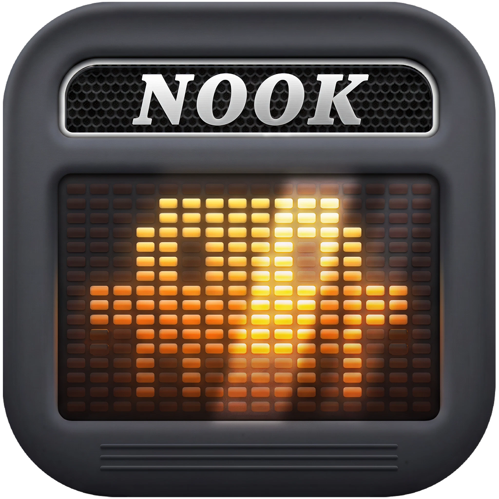
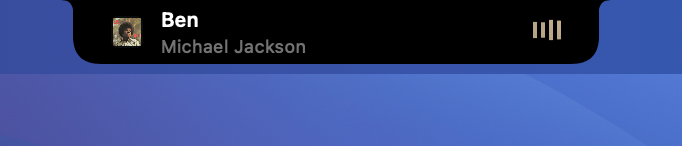
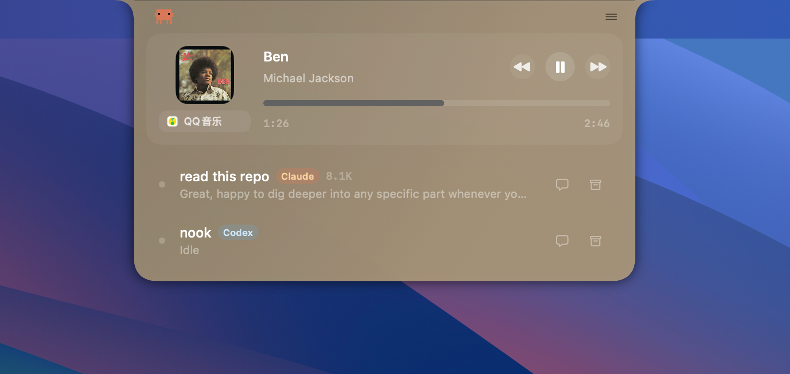

# Nook

<p align="center">
  
</p>

[English](../README.md)

Nook 想把 MacBook 的刘海，变成一个真正有存在感的工作界面。

它会在后台监听 Claude Code 和 Codex 的会话状态，把处理进度、会话变化、完成提醒这些关键信息放到 notch 里；同时也把音乐播放状态、封面和氛围背景带进来，让 AI 工作流和桌面氛围落在同一个空间里。

## 一眼了解 Nook

<p align="center">
  
</p>

收起状态下，Nook 大多数时候会保持安静；一旦 Claude、Codex 或音乐播放有值得注意的变化，它就会用非常轻的方式把状态带到视线中心。

<p align="center">
  
</p>

展开后，你可以直接看到会话列表、状态信息和音乐控制，不需要频繁切回终端或单独打开播放器。

## 为什么是 Nook

大多数 AI coding 工具还停留在终端标签页里，音乐控制又散落在系统别处。

Nook 想解决的是这件事：

- 不需要把终端始终摆在前面，也能看到 agent 在做什么
- 会话进入关键状态时，刘海区域会直接提醒你
- 音乐不再是割裂的另一套界面，而是工作流的一部分
- 展开状态下，封面颜色还能参与背景氛围，让整个 notch 更有生命感

它不是要占据你的桌面，而是想成为一个轻量但持续在线的状态层。

## 亮点

- 通过本地 hooks 同时追踪 Claude Code 和 Codex 会话
- 在收起态 notch 中展示紧凑但清晰的实时 activity
- 展开后可以查看会话列表和聊天详情
- 让活跃会话和状态变化更容易被注意到
- 把音乐播放信息、封面和进度合并进同一层界面
- 利用封面颜色生成更有氛围感的背景表现

## 核心能力

### AI 会话

- 通过 Claude hooks 追踪 Claude Code 会话
- 通过 Codex hooks 追踪 Codex 会话
- 在小 notch 里显示实时 activity
- 展开后查看会话列表和聊天详情
- 在任务完成、等待你继续输入时给出提示反馈

### 音乐能力

- 展示当前播放的歌曲、歌手、封面和进度
- 在展开 notch 中直接提供播放控制
- 当 AI 状态不重要时，自动切换为紧凑音乐 activity
- 根据封面提取颜色，生成更有氛围感的自适应背景

## 它更像什么

Nook 不想变成另一个聊天客户端，也不想变成完整音乐播放器。

它更像一个常驻的状态仪表层：

- 没事的时候安静
- 忙起来的时候有动势
- 需要你介入的时候足够直接
- 放歌的时候又能让桌面更有氛围

## 快速开始

### 环境要求

- macOS
- Xcode
- 如果要监听 Claude，会需要安装 Claude Code
- 如果要监听 Codex，会需要安装 Codex

### 安装

1. 打开发布的 `Nook.dmg`
2. 将 `Nook.app` 拖入 `Applications`
3. 从 `Applications` 中打开 `Nook`

由于当前版本还没有使用 Developer ID 正式签名，macOS 第一次启动时可能会拦截。

如果出现这个提示，可以这样处理：

1. 先尝试打开一次 `Nook`，看到系统提示后关闭它
2. 打开 `系统设置` -> `隐私与安全性`
3. 在安全性相关区域中允许 `Nook` 继续运行
4. 再次打开应用

### 构建

```bash
xcodebuild -project Nook.xcodeproj -scheme Nook -configuration Debug build
```

### 运行

从 Xcode 或 DerivedData 打开 `Nook.app`。应用启动后会自动：

- 保证单实例运行
- 安装或刷新 Claude hook
- 安装或刷新 Codex hook
- 启动本地 Unix socket 服务
- 创建 notch 窗口和 UI

## 项目结构

- `Nook/App`：应用生命周期、窗口和屏幕处理
- `Nook/Services/Hooks`：Claude/Codex hooks 安装与 socket 事件接入
- `Nook/Services/State`：中心化会话状态管理
- `Nook/Services/Session`：transcript 解析与会话监控
- `Nook/Services/Music`：音乐状态接入、播放控制、封面颜色提取
- `Nook/UI`：notch 窗口、视图和共享 UI 组件
- `Nook/Models`：会话、播放状态、工具结果等模型

## 本地集成说明

- Claude 的桥接脚本位于 `~/.claude/hooks/nook-state.py`
- Codex 的桥接脚本位于 `~/.codex/hooks/nook-codex-hook.py`
- 本地 socket 路径是 `/tmp/nook.sock`

## 致谢

Nook 的方向和灵感，和下面两个项目有很深的关联：

- [farouqaldori/claude-island](https://github.com/farouqaldori/claude-island)
- [TheBoredTeam/boring.notch](https://github.com/TheBoredTeam/boring.notch)

感谢它们为 notch 原生交互、常驻状态呈现和桌面氛围表达提供了很好的启发。
